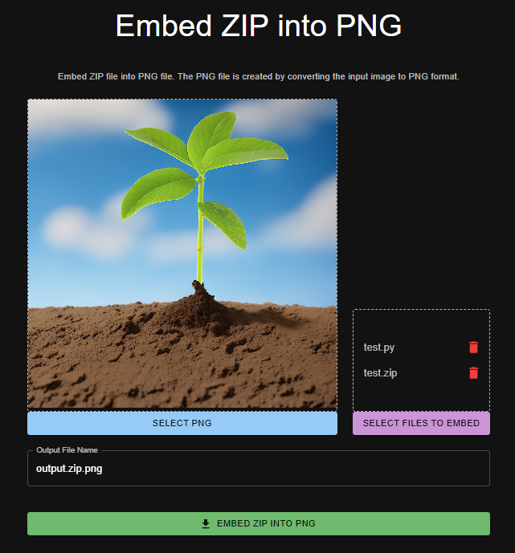

# Embed ZIP files to PNG

## これは何

ブラウザ上で、PNGファイルのIDATチャンクにZIPファイルを埋め込むだけのツールです。
ZIPファイルのオフセットなどを自動で計算するため、拡張子をただpng -> zipに変更するだけでZIPファイルとして開くことができます。

## 使い方

[https://u-haru.github.io/embed-files-to-png/](https://u-haru.github.io/embed-files-to-png/)

## その他

- 選択されたファイル(複数可)をZIP化し、そのZIPファイルをPNGファイルのIDATチャンクに埋め込みます。
- ZIP化にはjszipを使用しています。
- 選択したファイルが単一のZIPファイルだった場合はそのまま使用します。
- 画像の右下の1ピクセルだけ透明化処理が施されます(再エンコード対策)。